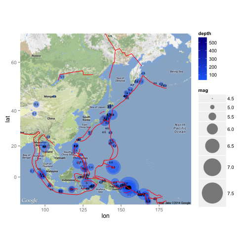

Rを使ったオープンデータの可視化3 2014/5/17
========================================================

今回はUSGSの地震観測データとテキサス大学地球物理研究所のプレート境界線をggmapで可視化してみる。

まずは、パッケージの読み込み。


```r
# 必要パッケージの読み込み
if (!require(RCurl)) {
    install.packages("RCurl")
    require(RCurl)
}
if (!require(ggmap)) {
    install.packages("ggmap")
    require(ggmap)
}
if (!require(maptools)) {
    install.packages("maptools")
    require(maptools)
}
```


つぎに、USGSの地震観測データをggmap+ggplot2で可視化する。


```r
# USGSの地震観測データの読み込み

# url <-
# getURL('http://earthquake.usgs.gov/earthquakes/feed/v1.0/summary/4.5_month.csv')

# dat <- read.csv(text=url)

if (!file.exists("4.5_month.csv")) {
    download.file(url = "http://earthquake.usgs.gov/earthquakes/feed/v1.0/summary/4.5_month.csv", 
        destfile = "4.5_month.csv")
}
dat <- read.csv(file = "4.5_month.csv")

# google static mapの取得
map <- get_map(location = c(139.8107, 35.710063), zoom = 3, source = "google")
```

```
## Map from URL : http://maps.googleapis.com/maps/api/staticmap?center=35.710063,139.8107&zoom=3&size=%20640x640&scale=%202&maptype=terrain&sensor=false
## Google Maps API Terms of Service : http://developers.google.com/maps/terms
```

```r
# map範囲の取得
bb <- attr(map, "bb")
# データの整理
dat2 <- subset(dat, latitude > bb$ll.lat & latitude < bb$ur.lat & longitude > 
    bb$ll.lon & longitude < bb$ur.lon)
# mapの描画
g <- ggmap(map)
g <- g + geom_point(data = dat2, aes(x = longitude, y = latitude, size = mag, 
    color = depth), alpha = 0.5)
g <- g + scale_color_continuous(low = "#1F75FE", high = "#00008B")
g <- g + scale_size_continuous(range = c(1, 20))
g <- g + geom_text(data = dat2, aes(x = longitude, y = latitude, label = mag), 
    size = 2)
```


最後にプレート境界線を描画する。


```r
# テキサス大学地球物理研究所PLATESプロジェクトからプレート境界線shapeファイルのダウンロード
if (!file.exists("tmp.zip")) {
    download.file(url = "http://www.ig.utexas.edu/research/projects/plates/data/plate_boundaries/PLATES_PlateBoundary_ArcGIS.zip", 
        destfile = "tmp.zip")
    unzip("tmp.zip")
}
# shapeファイルの読み込み
ridge <- readShapeSpatial("ridge")
ridge@data$id <- rownames(ridge@data)
ridge.fort <- fortify(ridge, region = "id")
ridge.fort <- ridge.fort[order(ridge.fort$order), ]
transform <- readShapeSpatial("transform")
transform@data$id <- rownames(transform@data)
transform.fort <- fortify(transform, region = "id")
transform.fort <- transform.fort[order(transform.fort$order), ]
trench <- readShapeSpatial("trench")
trench@data$id <- rownames(trench@data)
trench.fort <- fortify(trench, region = "id")
trench.fort <- trench.fort[order(trench.fort$order), ]
# プレート境界線の描画
g <- g + geom_path(data = ridge.fort, aes(long, lat, group = group), color = "red")
g <- g + geom_path(data = transform.fort, aes(long, lat, group = group), color = "red")
g <- g + geom_path(data = trench.fort, aes(long, lat, group = group), color = "red")
g
```

```
## Warning: Removed 78 rows containing missing values (geom_path).
## Warning: Removed 142 rows containing missing values (geom_path).
```

 


こういったことも手軽にできるRって素晴らしい。

<p><a rel="license" href="http://creativecommons.org/licenses/by/4.0/"></a><br /><span xmlns:cc="http://creativecommons.org/ns#" property="cc:attributionName">Masaharu Hayashi</span> を著作者とするこの 作品 は <a rel="license" href="http://creativecommons.org/licenses/by/4.0/">クリエイティブ・コモンズの 表示 4.0 国際 ライセンス</a>で提供されています。</p>
