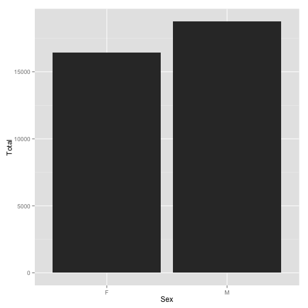
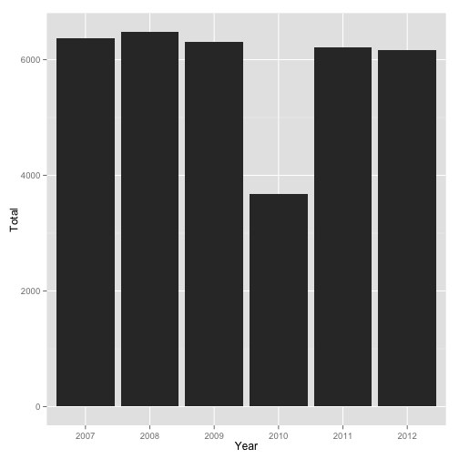
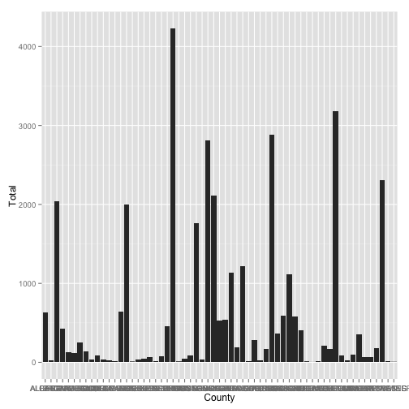
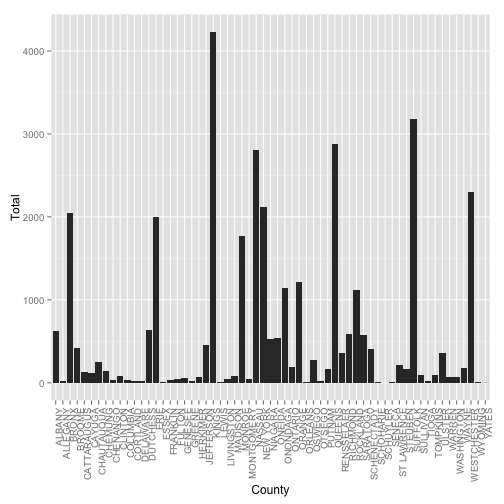
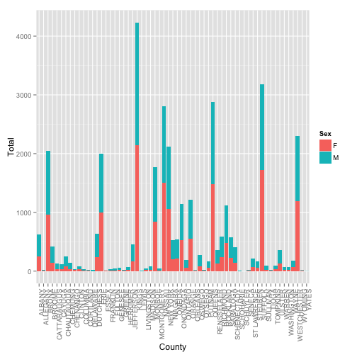
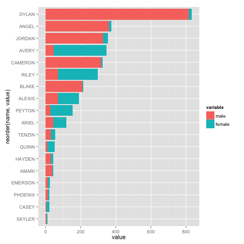

オープンデータの可視化1 2014/5/17
========================================================

data.govのオープンデータを使ってグラフを描いてみます。

対象データは「Baby Names: Beginning 2007」( http://catalog.data.gov/dataset/baby-names-beginning-2007 )です。

まず、必要となるパッケージを読み込みます。


```r
# パッケージを読み込む 未インストールの場合はインストール後に読み込む
if (!require(RCurl)) {
    install.packages("RCurl")
    require(RCurl)
}
if (!require(ggplot2)) {
    install.packages("ggplot2")
    require(ggplot2)
}
```


data.govからCSVファイルを読み込み、データの概要を確認します。


```r
# オープンデータの読み込み

# tmp <-
# getURL('https://health.data.ny.gov/api/views/jxy9-yhdk/rows.csv?accessType=DOWNLOAD',ssl.verifypeer
# = FALSE)

# CSV形式での読み込み

# data <- read.csv(text=tmp)

if (!file.exists("2007babyname.csv")) {
    download.file(url = "https://health.data.ny.gov/api/views/jxy9-yhdk/rows.csv?accessType=DOWNLOAD", 
        destfile = "2007babyname.csv", method = "curl")
}
data <- read.csv(file = "2007babyname.csv")
# オープンデータの確認（先頭数行のみ）
head(data)
```

```
##   Year First.Name      County Sex Count
## 1 2012    DOMINIC      CAYUGA   M     6
## 2 2012    ADDISON    ONONDAGA   F    14
## 3 2012      JULIA    ONONDAGA   F    15
## 4 2012    WILLIAM WESTCHESTER   M    41
## 5 2012     AMELIA    ONONDAGA   F    15
## 6 2012       LILY    ONONDAGA   F    15
```

```r
# オープンデータの概要
summary(data)
```

```
##       Year         First.Name            County      Sex      
##  Min.   :2007   JACOB   :  237   KINGS      : 4230   F:16453  
##  1st Qu.:2008   EMMA    :  223   SUFFOLK    : 3178   M:18764  
##  Median :2009   LOGAN   :  220   QUEENS     : 2882            
##  Mean   :2009   OLIVIA  :  217   NASSAU     : 2810            
##  3rd Qu.:2011   ISABELLA:  209   WESTCHESTER: 2306            
##  Max.   :2012   SOPHIA  :  200   NEW YORK   : 2116            
##                 (Other) :33911   (Other)    :17695            
##      Count      
##  Min.   :  5.0  
##  1st Qu.:  7.0  
##  Median : 12.0  
##  Mean   : 19.6  
##  3rd Qu.: 21.0  
##  Max.   :297.0  
## 
```


データのサイズと列名を確認します。


```r
# オープンデータのサイズ確認
dim(data)
```

```
## [1] 35217     5
```

```r
# オープンデータの列名確認
names(data)
```

```
## [1] "Year"       "First.Name" "County"     "Sex"        "Count"
```


簡単に集計してみます。


```r
# クロス集計(性別毎)
table(data$Sex)
```

```
## 
##     F     M 
## 16453 18764
```

```r
# クロス集計(調査年毎)
table(data$Year)
```

```
## 
## 2007 2008 2009 2010 2011 2012 
## 6367 6481 6312 3677 6216 6164
```

```r
# クロス集計(性別・年毎)
table(data$Sex, data$Year)
```

```
##    
##     2007 2008 2009 2010 2011 2012
##   F 3002 3039 2917 1705 2918 2872
##   M 3365 3442 3395 1972 3298 3292
```


性別毎にデータを集計します。


```r
# クロス集計結果をデータフレームに変換
tbl <- data.frame(table(data$Sex))
# 確認
tbl
```

```
##   Var1  Freq
## 1    F 16453
## 2    M 18764
```

```r
# 列名の設定
names(tbl) <- c("Sex", "Total")
# 確認
tbl
```

```
##   Sex Total
## 1   F 16453
## 2   M 18764
```

```r
# 各列の確認
tbl$Sex
```

```
## [1] F M
## Levels: F M
```

```r
tbl$Total
```

```
## [1] 16453 18764
```


集計結果をグラフにします。


```r
# 棒グラフの描画(x軸は性別、y軸は集計結果)
ggplot(tbl, aes(x = Sex, y = Total)) + geom_bar(stat = "identity")
```

 


調査年毎にデータを集計し、グラフにします。


```r
# クロス集計結果をデータフレームに変換
tbl <- data.frame(table(data$Year))
# 列名の設定
names(tbl) <- c("Year", "Total")
# 棒グラフの描画(横軸は年、縦軸は集計結果)
ggplot(tbl, aes(x = Year, y = Total)) + geom_bar(stat = "identity")
```

 


郡毎にデータを集計し、グラフにします。


```r
# クロス集計結果をデータフレームに変換
tbl <- data.frame(table(data$County))
# 列名の設定
names(tbl) <- c("County", "Total")
# 棒グラフの描画(横軸は郡、縦軸は集計結果)
ggplot(tbl, aes(x = County, y = Total)) + geom_bar(stat = "identity")
```

 


X軸ラベルが潰れて見えません。

X軸ラベルを縦にします。


```r
ggplot(tbl, aes(x = County, y = Total)) + geom_bar(stat = "identity") + theme(axis.text.x = element_text(angle = 90, 
    hjust = 1))
```

 


郡、性別毎にデータを集計し、グラフにします。


```r
# クロス集計
table(data$County, data$Sex)
```

```
##              
##                  F    M
##   ALBANY       251  379
##   ALLEGANY       7   18
##   BRONX        958 1087
##   BROOME       142  280
##   CATTARAUGUS   38   89
##   CAYUGA        29   84
##   CHAUTAUQUA    80  174
##   CHEMUNG       35  101
##   CHENANGO      17   17
##   CLINTON       32   55
##   COLUMBIA       8   24
##   CORTLAND      11   11
##   DELAWARE       3   15
##   DUTCHESS     242  397
##   ERIE         993 1009
##   ESSEX          5    2
##   FRANKLIN       6   27
##   FULTON        14   29
##   GENESEE       25   38
##   GREENE         6   13
##   HERKIMER      24   49
##   JEFFERSON    164  296
##   KINGS       2149 2081
##   LEWIS          2    6
##   LIVINGSTON    16   28
##   MADISON       24   62
##   MONROE       846  919
##   MONTGOMERY    10   30
##   NASSAU      1502 1308
##   NEW YORK    1063 1053
##   NIAGARA      205  323
##   ONEIDA       212  326
##   ONONDAGA     524  616
##   ONTARIO       63  126
##   ORANGE       547  669
##   ORLEANS        6    9
##   OSWEGO        86  193
##   OTSEGO         8   18
##   PUTNAM        63  109
##   QUEENS      1481 1401
##   RENSSELAER   125  240
##   RICHMOND     242  348
##   ROCKLAND     482  637
##   SARATOGA     225  354
##   SCHENECTADY  144  265
##   SCHOHARIE      2    7
##   SCHUYLER       0    1
##   SENECA         4   11
##   ST LAWRENCE   75  138
##   STEUBEN       53  115
##   SUFFOLK     1717 1461
##   SULLIVAN      25   67
##   TIOGA         10   12
##   TOMPKINS      31   62
##   ULSTER       125  232
##   WARREN        22   49
##   WASHINGTON    19   48
##   WAYNE         64  114
##   WESTCHESTER 1185 1121
##   WYOMING        6    8
##   YATES          0    3
```

```r
# クロス集計結果をデータフレームに変換
tbl <- data.frame(table(data$County, data$Sex))
# 列名の設定
names(tbl) <- c("County", "Sex", "Total")
# グラフ作成(x軸は郡、y軸は集計数,塗色は性別毎、ｘ軸ラベルは縦)
g <- ggplot(tbl, aes(x = County, y = Total, fill = Sex)) + geom_bar(stat = "identity")
g <- g + theme(axis.text.x = element_text(angle = 90, hjust = 1))
# グラフ描画
g
```

 


人気の名前ベスト10を表示してみます。


```r
# クロス集計
tbl <- table(data$First.Name)
# 上位10位の表示
sort(tbl, decreasing = TRUE)[1:10]
```

```
## 
##    JACOB     EMMA    LOGAN   OLIVIA ISABELLA   SOPHIA     NOAH    ETHAN 
##      237      223      220      217      209      200      197      195 
##    MASON  MICHAEL 
##      194      194
```


もう少し、こったグラフを描いてみます。

2012年の男女兼用名について調べてみます。


```r
# 2012年データの抽出
sub <- subset(data, Year == 2012)
# 男性データの抽出
male <- sub[sub$Sex == "M", ]
# 女性データの抽出
female <- sub[sub$Sex == "F", ]
# データの要約
summary(male)
```

```
##       Year          First.Name           County     Sex     
##  Min.   :2012   MASON    :  45   KINGS      : 359   F:   0  
##  1st Qu.:2012   LIAM     :  43   SUFFOLK    : 261   M:3292  
##  Median :2012   JACOB    :  37   QUEENS     : 241           
##  Mean   :2012   NOAH     :  37   NASSAU     : 237           
##  3rd Qu.:2012   ALEXANDER:  33   WESTCHESTER: 194           
##  Max.   :2012   JACKSON  :  33   ERIE       : 193           
##                 (Other)  :3064   (Other)    :1807           
##      Count      
##  Min.   :  5.0  
##  1st Qu.:  7.0  
##  Median : 11.0  
##  Mean   : 20.2  
##  3rd Qu.: 21.0  
##  Max.   :273.0  
## 
```

```r
summary(female)
```

```
##       Year         First.Name           County     Sex     
##  Min.   :2012   SOPHIA  :  44   KINGS      : 384   F:2872  
##  1st Qu.:2012   EMMA    :  42   SUFFOLK    : 300   M:   0  
##  Median :2012   OLIVIA  :  37   NASSAU     : 270           
##  Mean   :2012   ISABELLA:  35   QUEENS     : 244           
##  3rd Qu.:2012   AVA     :  30   WESTCHESTER: 226           
##  Max.   :2012   ABIGAIL :  29   ERIE       : 186           
##                 (Other) :2655   (Other)    :1262           
##      Count      
##  Min.   :  5.0  
##  1st Qu.:  6.0  
##  Median : 11.0  
##  Mean   : 16.6  
##  3rd Qu.: 18.0  
##  Max.   :204.0  
## 
```


データを集計します。


```r
# 名前をキーにCount列集計
m <- aggregate(male$Count, list(male$First.Name), sum)
names(m) <- c("name", "cnt")
# 名前をキーにCount列集計
f <- aggregate(female$Count, list(female$First.Name), sum)
names(f) <- c("name", "cnt")
# データ確認(先頭3行だけ表示)
head(m[order(m$cnt, decreasing = TRUE), ], n = 3)
```

```
##        name  cnt
## 367 MICHAEL 1317
## 230   JACOB 1289
## 251  JAYDEN 1211
```

```r
head(f[order(f$cnt, decreasing = TRUE), ], n = 3)
```

```
##         name  cnt
## 547   SOPHIA 1353
## 268 ISABELLA 1223
## 197     EMMA 1165
```


データを結合します。


```r
# 名前が一致する(=男女兼用名)データのみ結合
tmp <- merge(m, f, by = "name")
names(tmp) <- c("name", "male", "female")
# 男性への命名数が多い順に並び替え
tmp[order(tmp$male, decreasing = TRUE), ]
```

```
##       name male female
## 9    DYLAN  816     18
## 3    ANGEL  361     14
## 12  JORDAN  329     25
## 7  CAMERON  317      7
## 6    BLAKE  209      6
## 1   ALEXIS   70    119
## 16   RILEY   70    227
## 5    AVERY   46    302
## 4    ARIEL   44     75
## 2    AMARI   38      5
## 11  HAYDEN   29     14
## 18  TENZIN   29     25
## 13  PEYTON   26    128
## 10 EMERSON   13     12
## 14 PHOENIX   12     10
## 15   QUINN   10     43
## 8    CASEY    6     14
## 17  SKYLER    5      6
```


データを再構成します。


```r
# パッケージの読み込み(データフレーム再構成用)
library(reshape2)
# 男性への命名数が多い順に並び替え
tbl <- tmp[order(tmp$male, decreasing = TRUE), ]
# 名前をキーにデータ再構成
tbl <- melt(tbl, id = "name")
# 確認
tbl
```

```
##       name variable value
## 1    DYLAN     male   816
## 2    ANGEL     male   361
## 3   JORDAN     male   329
## 4  CAMERON     male   317
## 5    BLAKE     male   209
## 6   ALEXIS     male    70
## 7    RILEY     male    70
## 8    AVERY     male    46
## 9    ARIEL     male    44
## 10   AMARI     male    38
## 11  HAYDEN     male    29
## 12  TENZIN     male    29
## 13  PEYTON     male    26
## 14 EMERSON     male    13
## 15 PHOENIX     male    12
## 16   QUINN     male    10
## 17   CASEY     male     6
## 18  SKYLER     male     5
## 19   DYLAN   female    18
## 20   ANGEL   female    14
## 21  JORDAN   female    25
## 22 CAMERON   female     7
## 23   BLAKE   female     6
## 24  ALEXIS   female   119
## 25   RILEY   female   227
## 26   AVERY   female   302
## 27   ARIEL   female    75
## 28   AMARI   female     5
## 29  HAYDEN   female    14
## 30  TENZIN   female    25
## 31  PEYTON   female   128
## 32 EMERSON   female    12
## 33 PHOENIX   female    10
## 34   QUINN   female    43
## 35   CASEY   female    14
## 36  SKYLER   female     6
```


グラフを描画します。


```r
# 列名の確認
names(tbl)
```

```
## [1] "name"     "variable" "value"
```

```r
# 横棒グラフの描画
g <- ggplot(tbl, aes(x = reorder(name, value), y = value, fill = variable))
g <- g + geom_bar(stat = "identity") + coord_flip()
g
```

 


以上、data.govのデータを使った可視化例でした。

<a rel="license" href="http://creativecommons.org/licenses/by/4.0/"></a><br /><span xmlns:cc="http://creativecommons.org/ns#" property="cc:attributionName">Masaharu Hayashi</span> を著作者とするこの 作品 は <a rel="license" href="http://creativecommons.org/licenses/by/4.0/">クリエイティブ・コモンズの 表示 4.0 国際 ライセンス</a>で提供されています。
