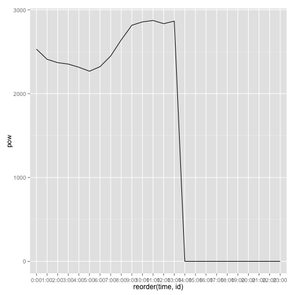
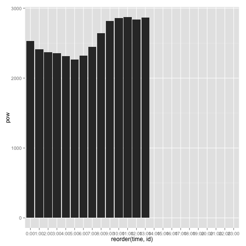
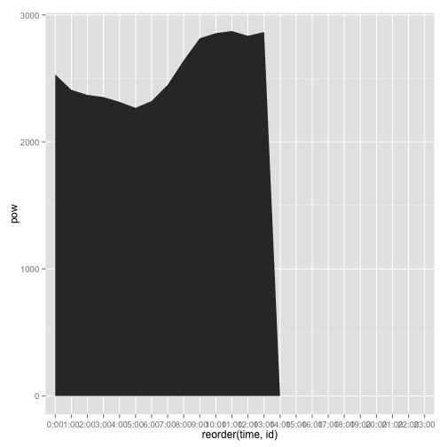
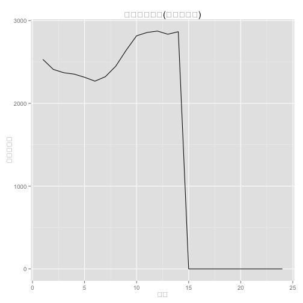
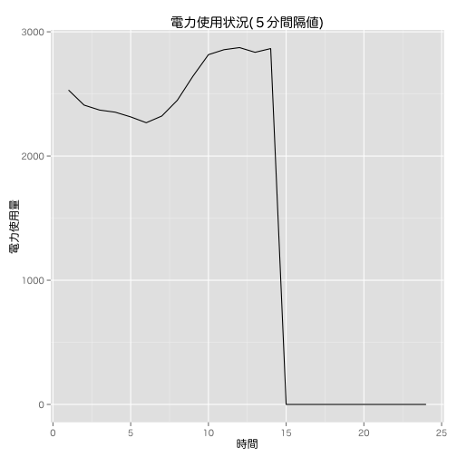

Rを使ったオープンデータの可視化2 2014/5/17
========================================================

東京電力の電力使用状況（ http://www.tepco.co.jp/forecast/index-j.html　）をグラフにします。

まず、必要となるパッケージを読み込みます。


```r
# パッケージを読み込む 未インストールの場合はインストール後に読み込む
if (!require(RCurl)) {
    install.packages("RCurl")
    require(RCurl)
}
if (!require(ggplot2)) {
    install.packages("ggplot2")
    require(ggplot2)
}
```


CSVを読み込み、グラフにします。

東京電力のCSVデータは複数のデータが格納されているので、必要箇所のみ読み込んでいます。


```r
# .mapUnicode=FALSEはエラー「nchar(str) : 1 は不正なマルチバイト文字です
# 」が発生する場合につける

# url <-
# getURL(url='http://www.tepco.co.jp/forecast/html/images/juyo-j.csv',.encoding='Shift_JIS',.mapUnicode=FALSE)

# csv<-read.csv(text=url,header=FALSE,skip=8,nrow=24)

if (!file.exists("juyo-j.csv")) {
    download.file(url = "http://www.tepco.co.jp/forecast/html/images/juyo-j.csv", 
        destfile = "juyo-j.csv")
}

csv <- read.csv(file = "juyo-j.csv", header = FALSE, skip = 8, nrow = 24)

# 処理しやすいように項目名をつける
names(csv) <- c("date", "time", "pow", "yosoku")
# 並び替えのための行番号をつける
csv$id <- as.numeric(row.names(csv))
# 折れ線グラフをつくる。X軸はtimeの値をidの値で並び替えている。
ggplot(csv, aes(x = reorder(time, id), y = pow, group = date)) + geom_line()
```

 


グラフを棒グラフで描いてみます。


```r
# 棒グラフをつくる。X軸はtimeの値をidの値で並び替えている。
ggplot(csv, aes(x = reorder(time, id), y = pow, group = date)) + geom_bar(stat = "identity")
```

 


面グラフにしてみます。


```r
# 面グラフをつくる。X軸はtimeの値をidの値で並び替えている。
ggplot(csv, aes(x = reorder(time, id), y = pow, group = date)) + geom_area()
```

 


最後に5分間隔値のグラフを描画します。


```r
# 288 = 24 * 60 / 5
csv <- read.csv(text = url, header = FALSE, skip = 44, nrow = 288)
```

```
## Error: 'text' 引数が不正です
```

```r
# 処理しやすいように項目名をつける
names(csv) <- c("date", "time", "pow")
# 並び替えのための行番号をつける
csv$id <- as.numeric(row.names(csv))
# 折れ線グラフをつくる。X軸はidで。
g <- ggplot(csv, aes(x = id, y = pow, group = date)) + geom_line()
# タイトル、Y軸ラベル、X軸ラベルの設定
g <- g + ggtitle("電力使用状況(５分間隔値)") + ylab("電力使用量") + 
    xlab("時間")
# X軸の目盛りを24分割、ラベルは0から23を使用。epand=c(0,0)で左右の余白を削除
g <- g + scale_x_continuous(breaks = seq(min(csv$id), max(csv$id), 12), labels = seq(0, 
    23), expand = c(0, 0))
```

```
## Error: Breaks and labels have unequal lengths
```

```r
g
```

 


OS Xの場合はフォントを指定してやります。

ref:http://kohske.wordpress.com/2011/02/26/using-cjk-fonts-in-r-and-ggplot2/


```r
quartzFonts(HiraMaru = quartzFont(rep("HiraMaruProN-W4", 4)))
g + theme_grey(base_family = "HiraMaru")
```

 


文字化けがなくなった！

以上、オープンデータの可視化例でした。

<p><a rel="license" href="http://creativecommons.org/licenses/by/4.0/"></a><br /><span xmlns:cc="http://creativecommons.org/ns#" property="cc:attributionName">Masaharu Hayashi</span> を著作者とするこの 作品 は <a rel="license" href="http://creativecommons.org/licenses/by/4.0/">クリエイティブ・コモンズの 表示 4.0 国際 ライセンス</a>で提供されています。</p>
